JG_Programming_Kaleidoscope

This project is a portfolio piece for my data science resume. I used the programming language, "Blinkscript" (used to create custom nodes in The Foundry Nuke) to create kaleidoscope effects.

## Project Summary

I really like 3D fractals. Here is a render I made using the free program, "Mandelbulb 3D".

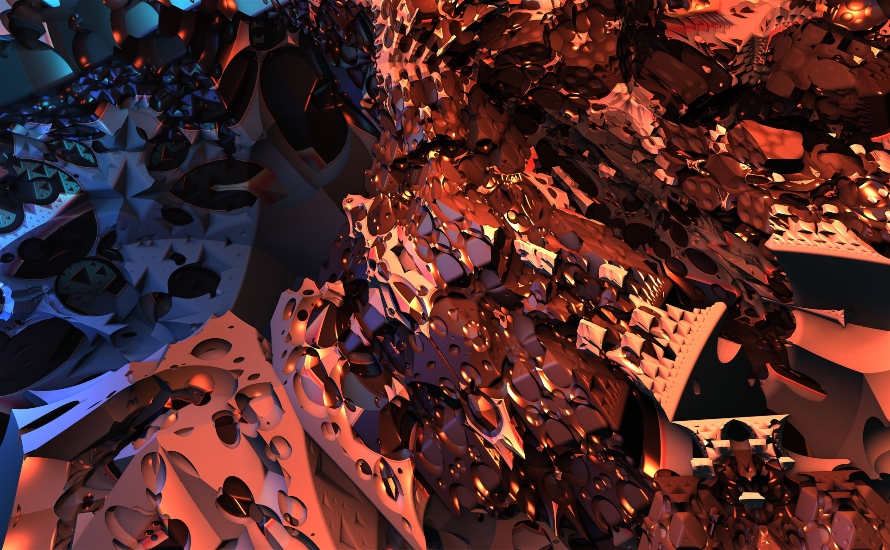

I also like kaleidoscope effects, sometimes called mandalas. I wanted to use The Foundry Nuke to create a node graph that would take any input image, and give all the possible mandalas within that image.

You can see how complicated the node graph became. It was reasonably fast, but it had some issues.

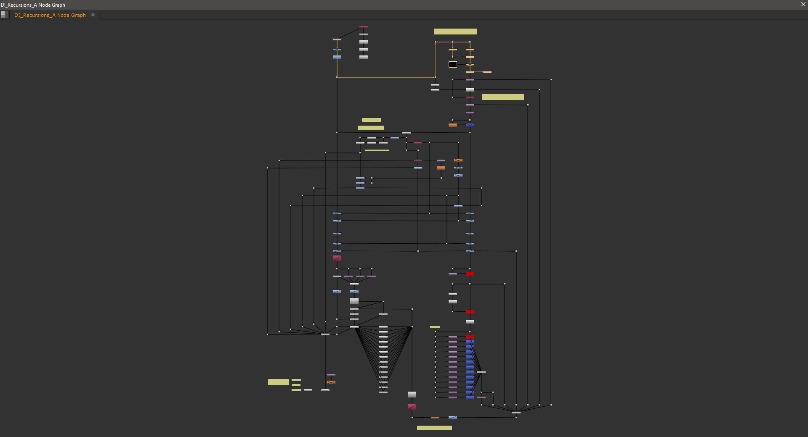

I took all of the above nodes and grouped them into a single node, exposing only those parameters to the group that were needed to control what kind of kaleidoscope I wanted to create. I animated all these parameters to get a variety of kaleidoscopes.

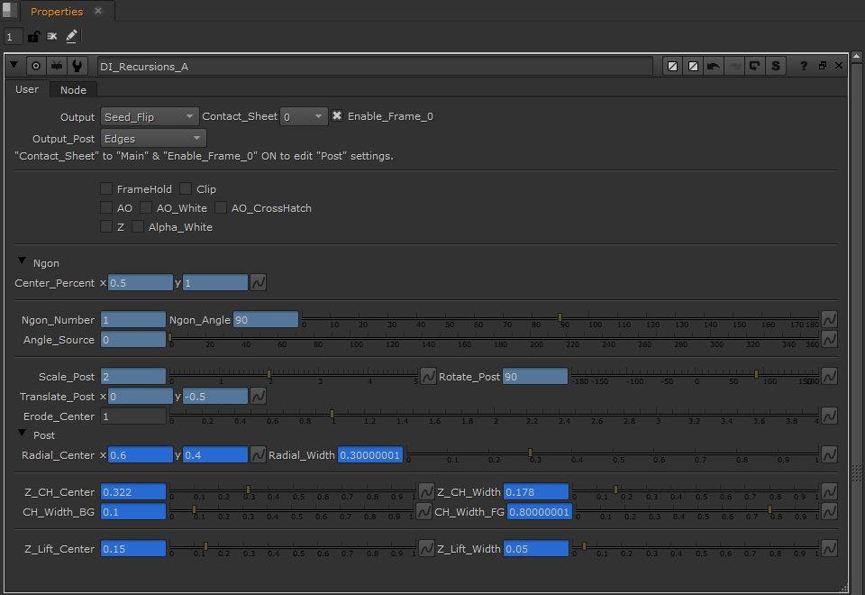

Eventually I realized that such a node graph was not performant enough to be practical, so I tried converting all those nodes into code using The Foundry Nuke's programming language, "Blinkscript," which is based in C++. Blinkscript is very powerful, but confusing at first.

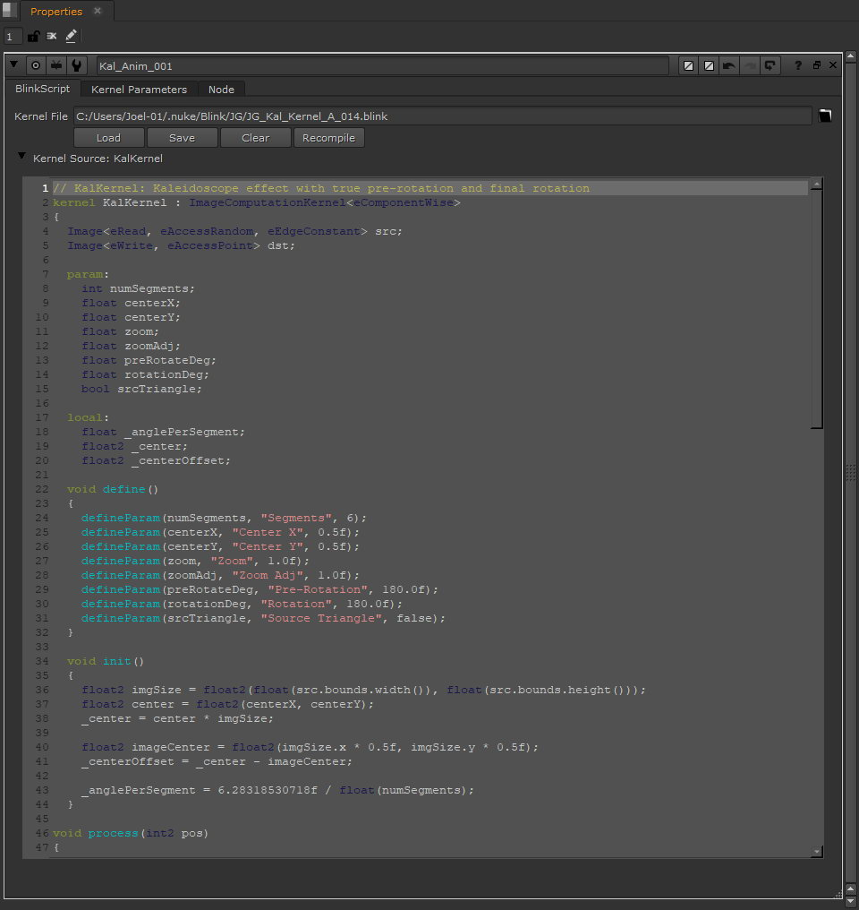

Here's a six-sided kaleidoscope using the original fractal as an input.

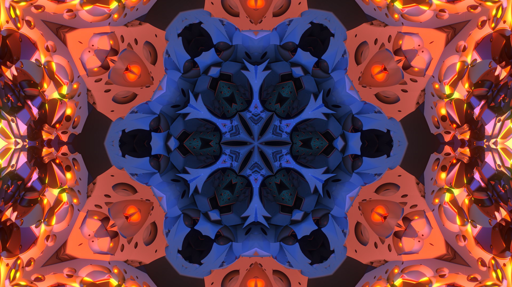

The Blinkscript code works for any segment count greater than 2. Here's kaleidoscopes of 3, 4, 5, and 6.

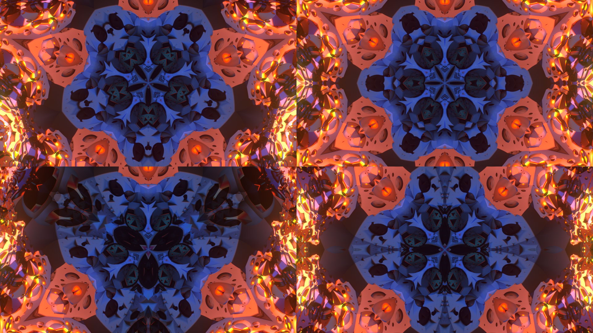

It's fun to really ramp up the number of segments. It's super performant, even when I set segments = 50.

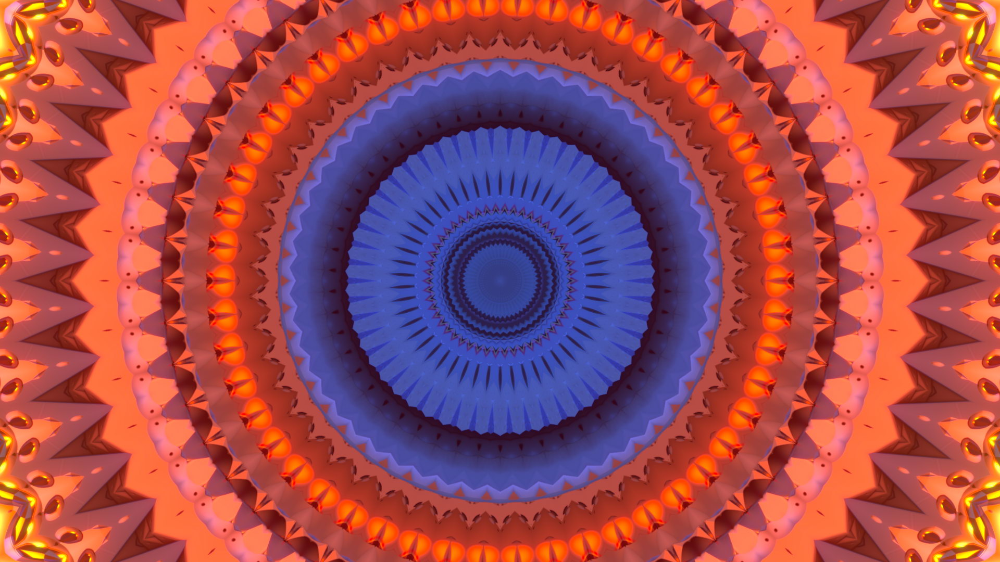

I made an option to show the source triangle to make it easier to know where the Blinkscript kernel is getting its data from in the image. The contents of the white triangle are mirrored counterclockwise, and then those two segments are duplicated around until they meet back with the source triangle.

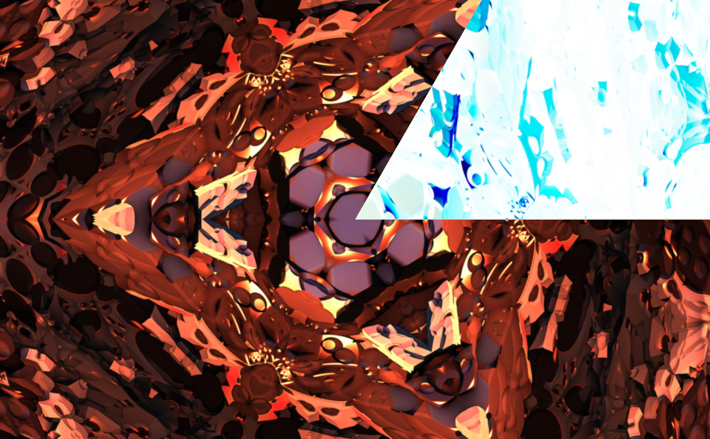

I animated the source triangle all over the image and then made a contact sheet node, showing all the possible kaleidoscopes of a given image in one big collage. The center of the source triangle was moved horizontally and vertically in 25% increments, and rotated in 30 degree increments. The Blinkscript code works with any given input resolution that way.

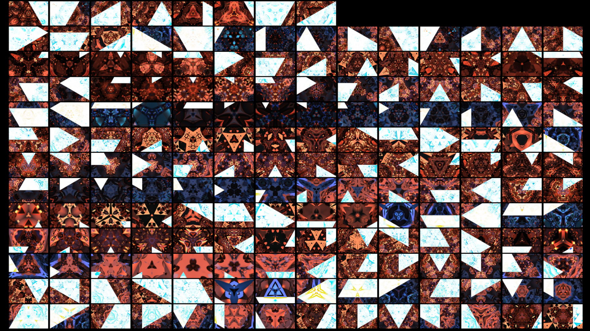

I added a text node which displays the current frame directly on top of each kaleidoscope. This way, I can easily tell which frame of the kaleidoscope I want to render at full resolution.

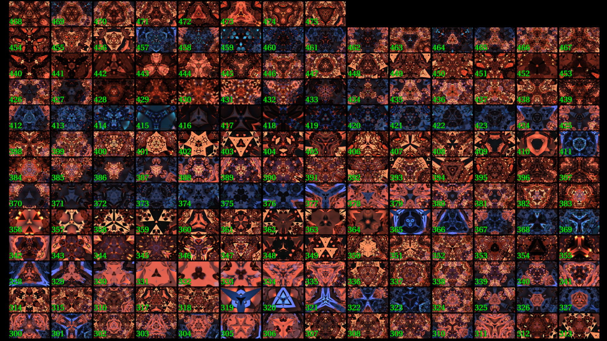

This is what the kaleidoscope kernel's properties looks like on the left, and what the parameters of those values looks like animated in the curve editor on the right.

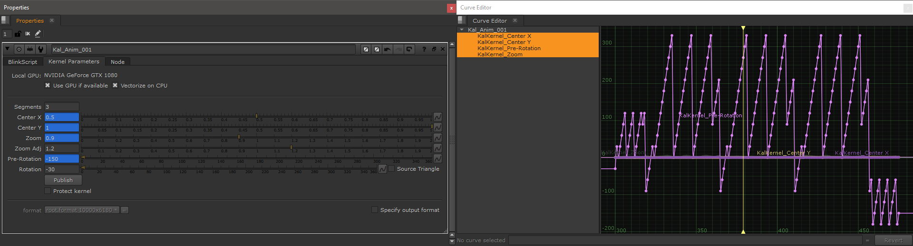

The Blinkscript kernel works great with any given input image! Here's another.

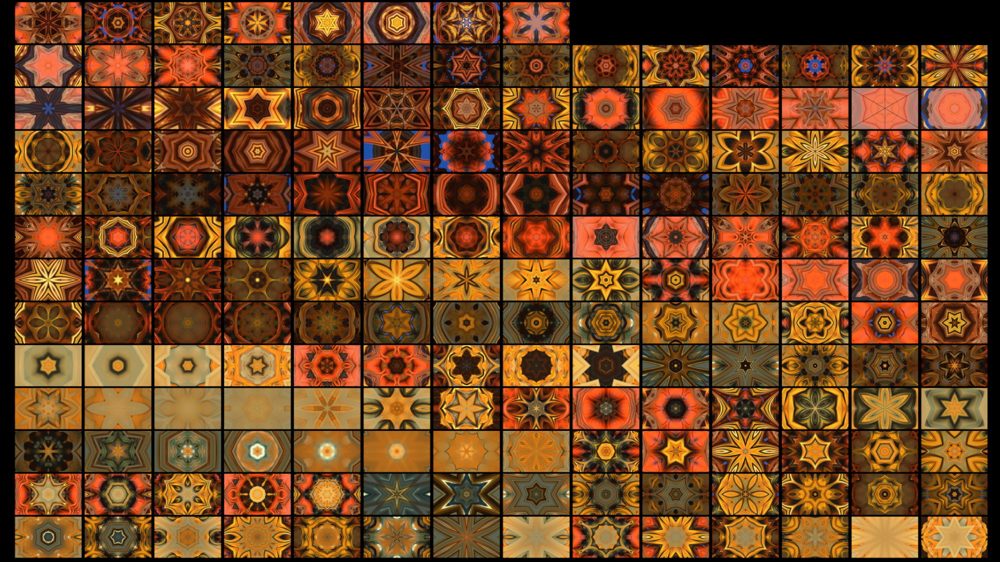

Here are some more full resolution kaleidoscope images. Aren't they a beauty?

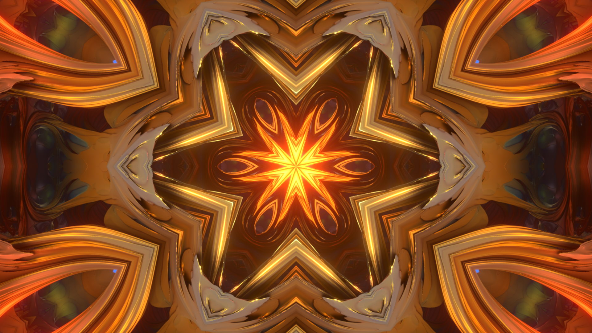

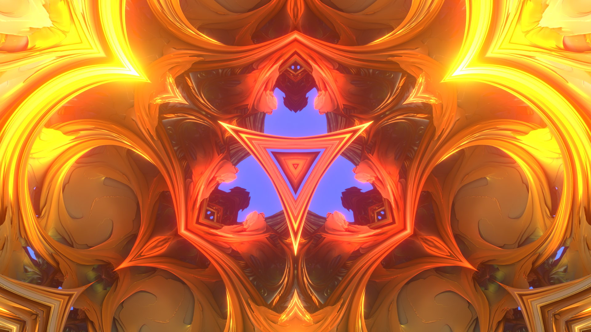

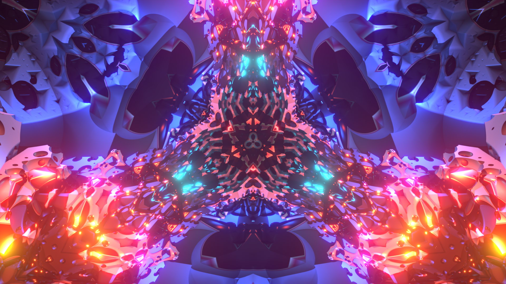

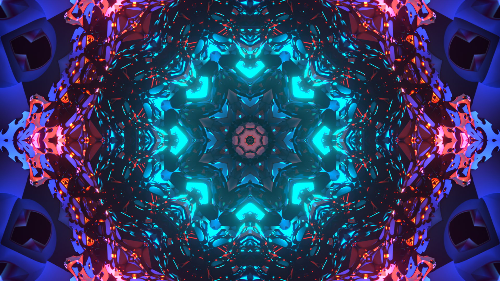

Type of project: Programming / visualization

Tools used: Nuke, Blinkscript, ChatGPT